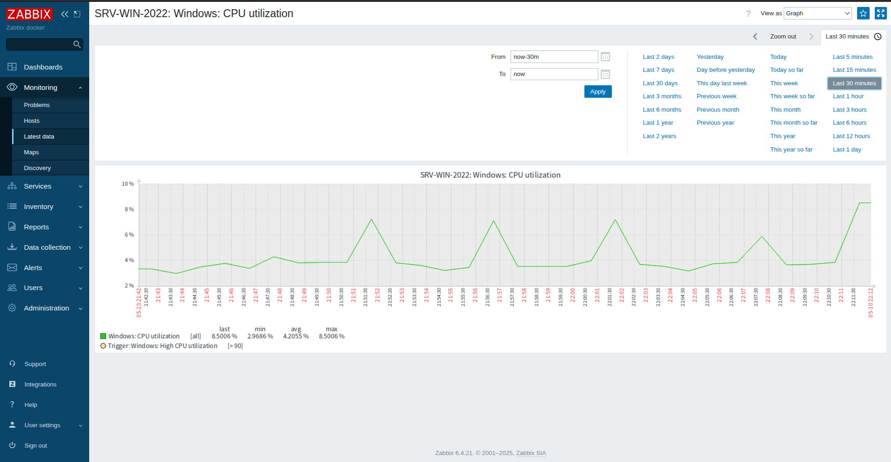
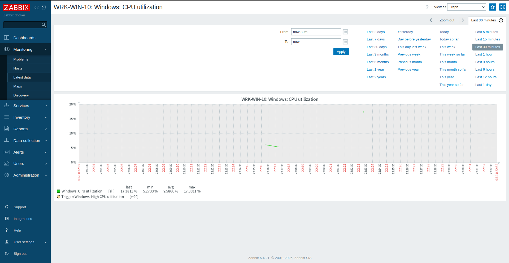

# zabbix-monitoring-lab
# Hybrid Monitoring Lab: Zabbix & Docker

## Opis projektu
Projekt autorskiego laboratorium monitoringu opartego na stosie Zabbix, wdrożonego w architekturze kontenerowej. System nadzoruje infrastrukturę hybrydową składającą się z systemów Linux (Ubuntu) oraz Windows (10 i Server 2022).

## Stack Techniczny
* **Engine:** Docker & Docker Compose
* **Monitoring:** Zabbix (v6.4.21)
* **Database:** PostgreSQL
* **OS & HARDWARE:**
### Wykaz monitorowanych hostów

| Nazwa Hostu | System Operacyjny | Adres IP (zanonimizowany) | Wersja Agenta | Status |
|:---|:---|:---|:---|:---|
| **SRV-WIN-2022** | Windows Server 2022 | 192.168.1.xxx | 7.0.25 | ✅ Aktywny |
| **WRK-WIN-10** | Windows 10 IoT | 192.168.1.xxx | 7.0.26 | ✅ Aktywny |
| **UBUNTU-HOST** | Ubuntu 24.04 LTS | 172.17.0.1 (Docker GW) | 7.0.26 | ✅ Aktywny |       |                                      |                  |                        |                         |                                       |                |     |
### Infrastruktura Sprzętowa (Lab Hardware)

| Hostname | Procesor | RAM | Rola w Laboratorium |
|:---|:---|:---|:---|
| **UBUNTU-HOST** | Intel Core i5-5200U (2.20GHz) | 8GB DDR3 1600MHz | Host Docker, Zabbix Server, DB |
| **SRV-WIN-2022** | Intel Celeron N2840 (2.16GHz) | 4GB DDR3 1333MHz | Monitorowany Serwer (Active Agent) |
| **WRK-WIN-10** | Intel Pentium P6200 (2.13GHz) | 8GB DDR3 1333MHz | Monitorowana Stacja Robocza |
## Architektura (Draft)
Serwer Zabbix pracuje wewnątrz izolowanej sieci Dockerowej, komunikując się z agentami na hostach fizycznych i wirtualnych poprzez mapowanie portów i konfigurację reguł firewall.

## Monitorowane parametry (Latest Data)

W ramach laboratorium skonfigurowałem zbieranie kluczowych metryk wydajnościowych:
* **CPU Load / Utilization** (procentowe zużycie oraz obciążenie średnie).
* **Memory usage** (pamięć dostępna vs wykorzystana).
* **ICMP Ping** (dostępność hostów w sieci lokalnej).
* **System information** (wersje OS, uptime).

### Wizualizacja danych
Poniżej znajdują się zrzuty ekranu przedstawiające poprawną komunikację serwera z agentami oraz przykładowe wykresy wydajnościowe.

