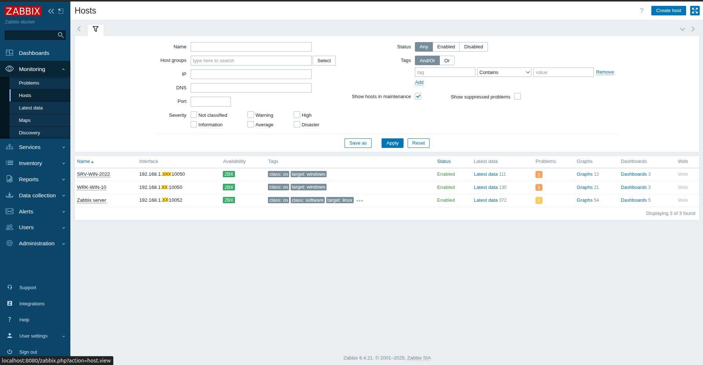
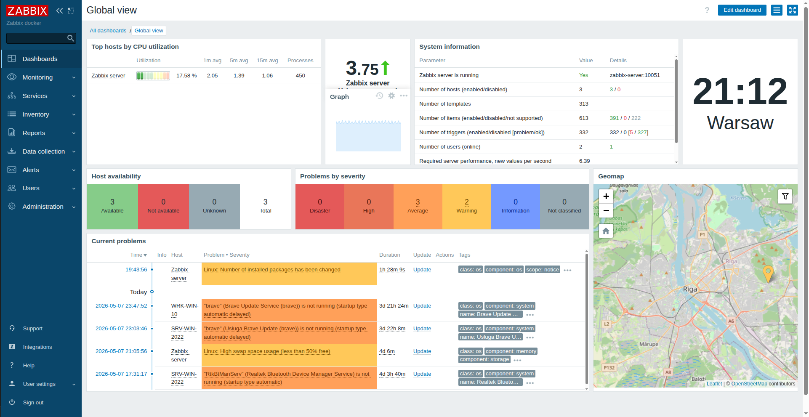
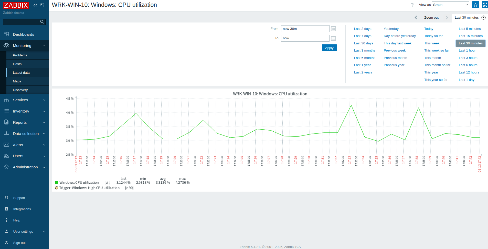
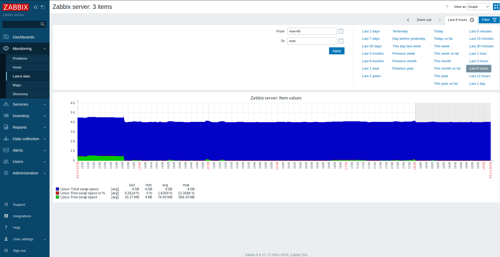
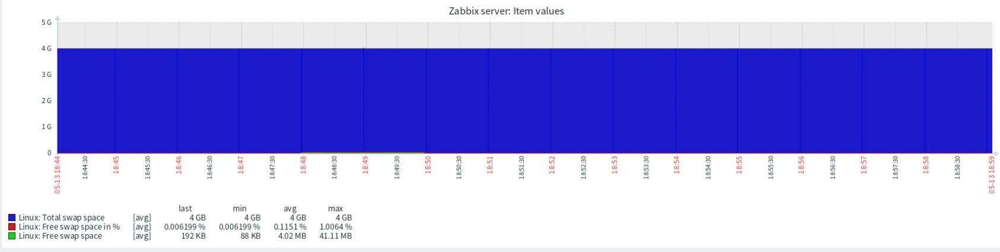
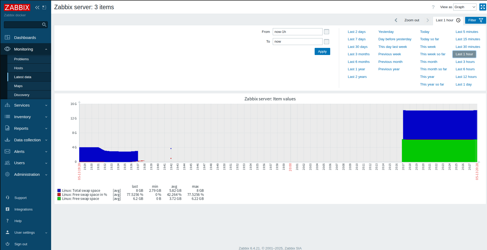

# zabbix-monitoring-lab
# Hybrid Monitoring Lab: Zabbix & Docker

## Opis projektu
Projekt autorskiego laboratorium monitoringu opartego na stosie Zabbix, wdrożonego w architekturze kontenerowej. System nadzoruje infrastrukturę hybrydową składającą się z systemów Linux (Ubuntu) oraz Windows (10 i Server 2022).

## Stack Techniczny
* **Engine:** Docker & Docker Compose
* **Monitoring:** Zabbix (v6.4.21)
* **Database:** PostgreSQL
* **OS & HARDWARE:**
### Wykaz monitorowanych hostów

| Nazwa Hostu | System Operacyjny | Adres IP (zanonimizowany) | Wersja Agenta | Status |
|:---|:---|:---|:---|:---|
| **SRV-WIN-2022** | Windows Server 2022 | 192.168.1.xxx | 7.0.25 | ✅ Aktywny |
| **WRK-WIN-10** | Windows 10 IoT | 192.168.1.xxx | 7.0.26 | ✅ Aktywny |
| **UBUNTU-HOST** | Ubuntu 24.04 LTS | 172.17.0.1 (Docker GW) | 7.0.26 | ✅ Aktywny |       |                                      |                  |                        |                         |                                       |                |     |
### Infrastruktura Sprzętowa (Lab Hardware)

| Hostname | Procesor | RAM | Rola w Laboratorium |
|:---|:---|:---|:---|
| **UBUNTU-HOST** | Intel Core i5-5200U (2.20GHz) | 8GB DDR3 1600MHz | Host Docker, Zabbix Server, DB |
| **SRV-WIN-2022** | Intel Celeron N2840 (2.16GHz) | 4GB DDR3 1333MHz | Monitorowany Serwer (Active Agent) |
| **WRK-WIN-10** | Intel Pentium P6200 (2.13GHz) | 8GB DDR3 1333MHz | Monitorowana Stacja Robocza |

## Konfiguracja sieciowa i Docker

Projekt wykorzystuje architekturę kontenerową oraz hybrydowe środowisko sieciowe (Wi-Fi/LAN), co pozwoliło na przetestowanie przepływu danych w warunkach zbliżonych do rzeczywistych sieci firmowych.

### Kluczowe aspekty infrastruktury:

* **Hybrydowe medium transmisyjne:** Serwer monitoringu (Ubuntu) pracuje w sieci bezprzewodowej (**Wi-Fi**), podczas gdy monitorowane stacje robocze podłączone są kablem (**LAN**). Wymusiło to precyzyjną konfigurację routingu na routerze, aby zapewnić pełną komunikację między różnymi segmentami sieci domowej.
* **Adresacja IP i Docker Gateway:**
    * **Publiczny adres hosta (LAN):** `192.168.1.24` – na tym adresie serwer nasłuchuje raportów od agentów Windows.
    * **Brama Dockera (Docker0):** `172.17.0.1` – adres wykorzystany do monitorowania systemu Ubuntu przez kontener Zabbixa (komunikacja na linii kontener <-> system gospodarza).
* **Zarządzanie portami (10051 / 10052):**
    * W załączonym pliku `docker-compose.yml` zastosowano standardowe mapowanie portów `- "10051:10051"`, co zapewnia bezproblemową komunikację z agentami w trybie Active.
    * W trakcie rozwoju projektu testowano również architekturę z wykorzystaniem portu **10052** jako zewnętrznego punktu styku. Pozwoliło to na zweryfikowanie elastyczności konfiguracji Zabbixa oraz przetestowanie reguł Firewall na stacjach Windows pod kątem niestandardowego ruchu wychodzącego.
* **Bezpieczeństwo i Anonimizacja (OPSEC):** Zrzuty ekranu zamieszczone w dokumentacji zawierają celowo zanonimizowane fragmenty adresów IP (oznaczone jako „XX” lub zakryte). Jest to świadome działanie zgodne z dobrymi praktykami bezpieczeństwa IT, mające na celu ochronę szczegółów technicznych infrastruktury przy publicznej prezentacji projektu.

### Pliki konfiguracyjne
W repozytorium znajduje się plik `docker-compose.yml`. Zgodnie z zasadami bezpieczeństwa, zmienne środowiskowe (hasła, loginy do bazy danych) zostały wydzielone do zewnętrznych plików `.env`, które nie są upubliczniane w systemie kontroli wersji.

W repozytorium znajduje się plik `docker-compose.yml` (z zanonimizowanymi danymi dostępowymi), który definiuje całe środowisko.

## Architektura (Draft)
Serwer Zabbix pracuje wewnątrz izolowanej sieci Dockerowej, komunikując się z agentami na hostach fizycznych i wirtualnych poprzez mapowanie portów i konfigurację reguł firewall. Architektura laboratorium wykorzystuje mieszane medium transmisyjne: serwer monitoringu (Ubuntu) komunikuje się poprzez sieć bezprzewodową (Wi-Fi), natomiast stacje monitorowane podłączone są do infrastruktury kablowej (LAN). Wymusiło to odpowiednią konfigurację reguł routingu na routerze brzegowym, aby zapewnić pełną idoczność między podsieciami.

## Monitorowane parametry (Latest Data)

W ramach laboratorium skonfigurowałem zbieranie kluczowych metryk wydajnościowych:
* **CPU Load / Utilization** (procentowe zużycie oraz obciążenie średnie).
* **Memory usage** (pamięć dostępna vs wykorzystana).
* **ICMP Ping** (dostępność hostów w sieci lokalnej).
* **System information** (wersje OS, uptime).

### Wizualizacja danych
Poniżej znajdują się zrzuty ekranu przedstawiające poprawną komunikację serwera z agentami oraz przykładowe wykresy wydajnościowe.
#### Status komunikacji z agentami

#### Dashboard Monitoringu

#### Wykres CPU Windows Server 2022

#### Wykres CPU Windows 10 IoT


## Dokumentacja problemów (Troubleshooting & Case Studies)

### 1. Architektura Portów i Łączność (Security & Networking)
Wdrożenie wymagało precyzyjnej konfiguracji przepływu pakietów między siecią izolowaną (Docker), systemem Ubuntu (Host) a zewnętrznymi stacjami Windows.

*   **Zastosowane Porty:**
    *   **10050 (TCP):** Wykorzystywany do odpytywania agentów w trybie pasywnym (Zabbix Server -> Agent).
    *   **10051 (TCP):** Kluczowy port dla trybu Aktywnego (Agent -> Zabbix Server).
    *   **10052 (TCP):** Zabbix Java Gateway – zarezerwowany dla przyszłej rozbudowy o monitorowanie aplikacji Java.
*   **Problem Windows Defender:** Heurystyka systemu Windows blokowała komunikację agenta po krótkim czasie aktywności. 
*   **Rozwiązanie:** Skonfigurowano wykluczenia (Exclusions) dla procesu `zabbix_agentd.exe` oraz reguły Inbound w Firewallu dla portów TCP **10050-10051**.
*   **Docker Bridge Networking:** Aby umożliwić monitorowanie systemu Ubuntu (hosta i5), w konfiguracji agenta ustawiono parametr `ServerActive=172.17.0.1` (adres bramy Docker), co pozwoliło na komunikację między siecią kontenerową a systemem macierzystym.

---

### 2. Desynchronizacja czasu (Timezone Mismatch)
**Problem:** Dane na wykresach pojawiały się z dużym opóźnieniem lub były całkowicie ignorowane przez bazę danych, co uniemożliwiało monitoring w czasie rzeczywistym.

**Diagnoza (Root Cause Analysis):**
Podczas inspekcji logów wykryto konflikt stref czasowych pomiędzy elementami stosu:
*   **Hosty i Agenty:** Pracowały w czasie lokalnym (**CEST**, UTC+2).
*   **Zabbix Server (Kontener Docker):** Pracował w czasie uniwersalnym (**UTC**).
Zabbix Server interpretował dane od agentów jako "paczki z przyszłości", co powodowało błędy w indeksowaniu bazy danych SQL i powstawanie luk na osi czasu.

**Rozwiązanie:**
Zastosowano wymuszoną synchronizację strefy czasowej dla całego stosu technologicznego:
*   W pliku `docker-compose.yaml` dodano zmienną środowiskową: `TZ=Europe/Warsaw`.
*   Zmapowano pliki systemowe hosta `/etc/localtime` oraz `/etc/timezone` do kontenerów w trybie tylko do odczytu (`ro`).
*   **Weryfikacja poprawności (Timestamp z momentu naprawy):** 
    ```bash
    sudo docker exec -it zabbix-docker-zabbix-server-1 date
    # Wynik: Wed May 13 12:41:17 CEST 2026

### 3. Wydajność sprzętowa vs Model Komunikacji (Case Study: WRK-WIN-10)

**Problem:**  
Mimo poprawnej synchronizacji czasu (UTC/CEST), wykresy dla stacji roboczej **WRK-WIN-10** (Intel Pentium P6200, 8GB DDR3 1333MHz) nadal wykazywały brak ciągłości danych (charakterystyczne "dziury" na osi czasu).

**Analiza wydajnościowa:**  
*   Zaobserwowano, że maszyna **SRV-WIN-2022** (Intel Celeron N2840, 4GB RAM), mimo słabszej specyfikacji, utrzymywała stabilne połączenie w trybie pasywnym.
*   W przypadku procesora Pentium P6200 na stacji **WRK-WIN-10**, tryb pasywny (nasłuchiwanie na porcie 10050) okazał się nieefektywny. Starsza architektura procesora nie radziła sobie z terminowym generowaniem odpowiedzi na zapytania serwera w oknie czasowym (*Timeout*), co skutkowało porzucaniem pakietów.

**Rozwiązanie:**  
*   Podjęto decyzję o zmianie modelu komunikacji na **Zabbix Agent (Active)** wyłącznie dla tej jednostki.
*   W tym trybie agent samodzielnie inicjuje połączenie i przesyła dane na port **10051** serwera w momencie dostępności wolnych cykli procesora.
*   Dzięki odciążeniu procesora od stałego nasłuchiwania na porcie 10050, uzyskano pełną ciągłość danych i stabilizację wykresów.

**Weryfikacja wizualna:**  

#### Zrzut ekranu: Ciągły wykres CPU po zmianie na Active

#### Wykres CPU Windows 10 IoT przed zmianą na Active


### 4. Diagnostyka i optymalizacja pamięci operacyjnej (Zabbix Self-Monitoring)

**Problem:** 
Mapa topologiczna sieci zgłosiła krytyczne ostrzeżenie dla węzła **Zabbix Server**. System operacyjny hosta (Ubuntu) raportował niemal całkowite wyczerpanie przestrzeni wymiany SWAP (ponad 99% zajętości).

**Analiza (Root Cause Analysis):**
Na podstawie 6-godzinnego wykresu historycznego (**linuxSwapFreeSpaceIssue6h.png**) zdiagnozowano liniowy trend wzrostu zużycia pamięci. 
*   **Początek okresu:** Wolna przestrzeń SWAP wynosiła ok. 500-600 MB.
*   **Koniec okresu:** Wolna przestrzeń spadła do krytycznego poziomu **192 KB** (0.006%), co udokumentowano na szczegółowym wykresie parametrów (**image_1fe457.png**).
Główną przyczyną było wysokie zapotrzebowanie kontenerów Docker (Zabbix Server + Baza danych SQL) na pamięć RAM, co wymusiło na jądrze Linuxa przeniesienie nieaktywnych stron pamięci do zbyt małego pliku `/swapfile` (domyślnie 4GB).

**Rozwiązanie:** 
Zdecydowano o natychmiastowej interwencji systemowej w celu uniknięcia aktywacji mechanizmu *OOM Killer* (Out Of Memory Killer), który mógłby doprowadzić do niekontrolowanego zamknięcia serwera Zabbix.

1.  **Rozszerzenie zasobów:** Powiększono plik wymiany z 4GB do **8GB** przy użyciu narzędzi systemowych `fallocate` oraz `mkswap`.
2.  **Optymalizacja Kernel Linux:** Skonfigurowano parametr `vm.swappiness=10`, co ogranicza skłonność systemu do korzystania ze SWAP-a, gdy dostępny jest jeszcze fizyczny RAM, co znacząco poprawia wydajność operacji I/O.
3.  **Weryfikacja:** Po zmianach system odzyskał 77,5% wolnej przestrzeni wymiany, co potwierdzono zmianą statusu na mapie sieci na "OK" (zielony).

> Referencja wizualna:
#### Trend wyczerpywania pamięci w ciągu 6 godzin.

#### Stan krytyczny tuż przed interwencją administratora

#### Stan po rozszerzeniu zasobów pliku wymiany z 4GB do 8GB 
